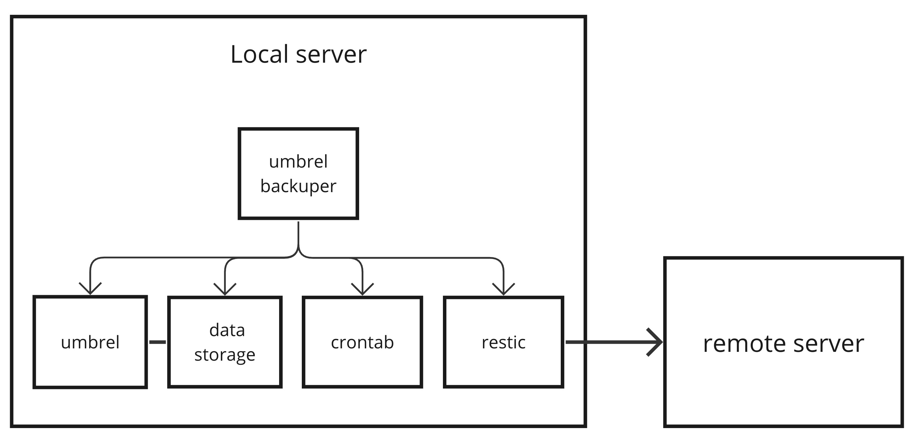

# Umbrel backuper
This is a bash script that will help you backup your [Umbrel](https://umbrel.com/) apps data to a remote server. It will change data location of apps that you will specify in the `variables` file and then it will create a backup of that data using restic.

This is useful if you want to keep some of your apps on default installation location and some of them on external drive. You can also use this script to backup your data to a remote server.

I like to keep my bitcoin/lnd related data and apps on the default location (because I have it on NVMe disk) and other apps which doesn't require that much performance I keep on slower external drive.

## Architecture
**Umbrel backuper** is just a glue tool to setup umbrel, data storage, [restic](https://restic.net/) and crontab to work together.

## Installation
1. SSH into your Umbrel node
2. Clone this repository
3. Update the `variables` file to match your setup
4. Update the `password` file with your restic repository password (if repository is not setup yet just define something and it will be used to create the repository)
5. Run `sudo ./install.sh`

## Test backup restoration
1. Make sure there were some changes to the app like uploading some files or installing some apps to Nextcloud so you can verify that the data is restored at the end
2. Make sure you ran backup procedure after changes (you can run it manually with `sudo ./restic-backuper.sh`)
2. Delete the app in umbrel GUI (in this case Nextcloud)
3. Remove the app data from backup dir `sudo rm -rf $BACKUP_DIR` (replace `$BACKUP_DIR` with your backup dir defined in variables file)
4. Now everything should be deleted related to the app
5. Install the app again from umbrel store
6. Run `sudo ./change-data-folder.sh --restore`
7. Verify that the data is restored

## FAQ
### Why do I need to run this as root?
Because some apps in the docker volume write data as root and we need to be able to read it so we can do proper backup.
